# Flock Framework Architecture Report & Assessment

**Date**: May 2025  
**Version**: Post Unified Architecture Refactoring  
**Status**: Production Ready with Optimization Opportunities

## Executive Summary

The Flock framework has successfully transitioned from a complex 4-concept architecture to a clean 2-concept unified system. This report evaluates the current state, provides architectural visualizations, and identifies optimization opportunities.

**Overall Architecture Rating: 8.5/10** â­â­â­â­â­â­â­â­â˜†â˜†

## 1. Current Architecture Overview

### 1.1 High-Level System Architecture

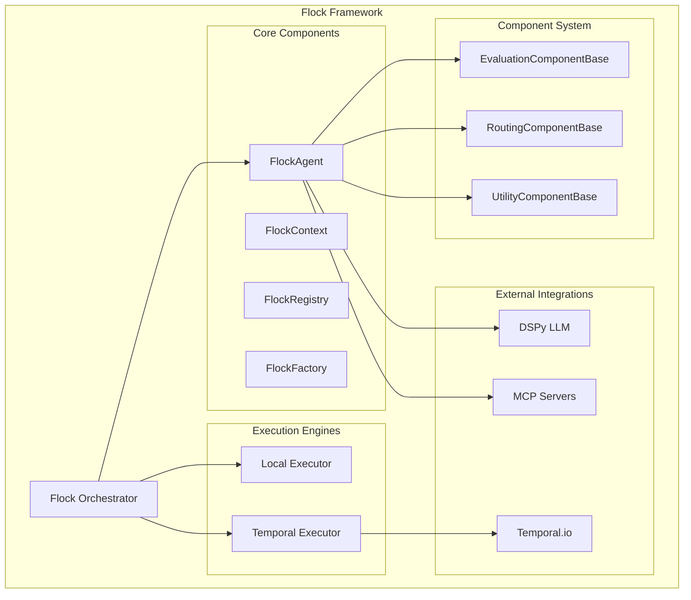
```mermaid
graph TB
    subgraph "Flock Framework"
        Flock[Flock Orchestrator]
        
        subgraph "Core Components"
            FlockAgent[FlockAgent]
            FlockContext[FlockContext]
            FlockRegistry[FlockRegistry]
            FlockFactory[FlockFactory]
        end
        
        subgraph "Component System"
            EvalBase[EvaluationComponentBase]
            RouteBase[RoutingComponentBase] 
            UtilBase[UtilityComponentBase]
        end
        
        subgraph "Execution Engines"
            LocalExec[Local Executor]
            TemporalExec[Temporal Executor]
        end
        
        subgraph "External Integrations"
            DSPy[DSPy LLM]
            Temporal[Temporal.io]
            MCP[MCP Servers]
        end
    end
    
    Flock --> FlockAgent
    FlockAgent --> EvalBase
    FlockAgent --> RouteBase
    FlockAgent --> UtilBase
    Flock --> LocalExec
    Flock --> TemporalExec
    FlockAgent --> DSPy
    TemporalExec --> Temporal
    FlockAgent --> MCP
```

### 1.2 Unified Component Architecture

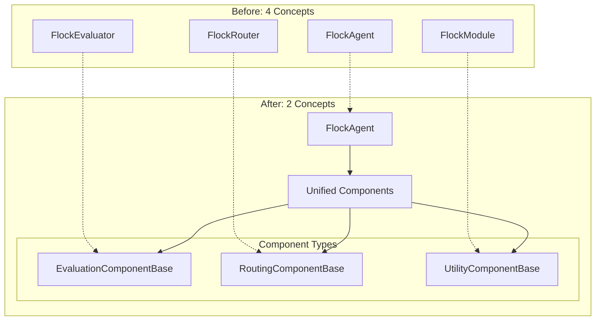
```mermaid
graph TD
    subgraph "Before: 4 Concepts"
        OldAgent[FlockAgent]
        OldEval[FlockEvaluator]
        OldRouter[FlockRouter] 
        OldModule[FlockModule]
    end
    
    subgraph "After: 2 Concepts"
        NewAgent[FlockAgent]
        Components[Unified Components]
        
        subgraph "Component Types"
            Eval[EvaluationComponentBase]
            Route[RoutingComponentBase]
            Util[UtilityComponentBase]
        end
    end
    
    OldAgent -.-> NewAgent
    OldEval -.-> Eval
    OldRouter -.-> Route
    OldModule -.-> Util
    
    NewAgent --> Components
    Components --> Eval
    Components --> Route
    Components --> Util
    
 
    
    class OldAgent,OldEval,OldRouter,OldModule old
    class NewAgent,Components,Eval,Route,Util new
```

## 2. Component Management Architecture

### 2.1 FlockAgent + Helper Composition

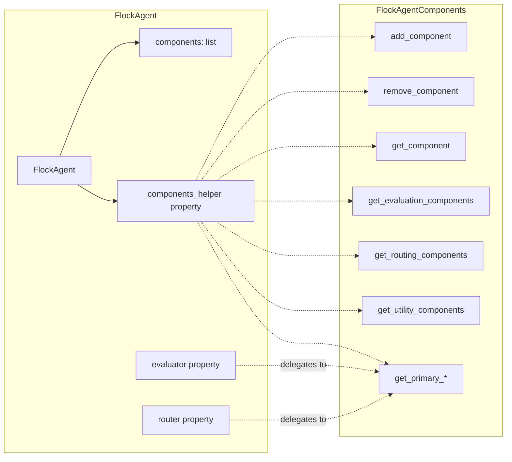
```mermaid
graph LR
    subgraph "FlockAgent"
        Agent[FlockAgent]
        Components[components: list]
        Evaluator[evaluator property]
        Router[router property]
        Helper[components_helper property]
    end
    
    subgraph "FlockAgentComponents"
        AddComp[add_component]
        RemoveComp[remove_component]
        GetComp[get_component]
        GetEval[get_evaluation_components]
        GetRoute[get_routing_components]
        GetUtil[get_utility_components]
        Primary[get_primary_*]
    end
    
    Agent --> Components
    Agent --> Helper
    Helper -.-> AddComp
    Helper -.-> RemoveComp
    Helper -.-> GetComp
    Helper -.-> GetEval
    Helper -.-> GetRoute
    Helper -.-> GetUtil
    Helper -.-> Primary
    
    Evaluator -.->|delegates to| Primary
    Router -.->|delegates to| Primary

```

### 2.2 Component Lifecycle & Registration

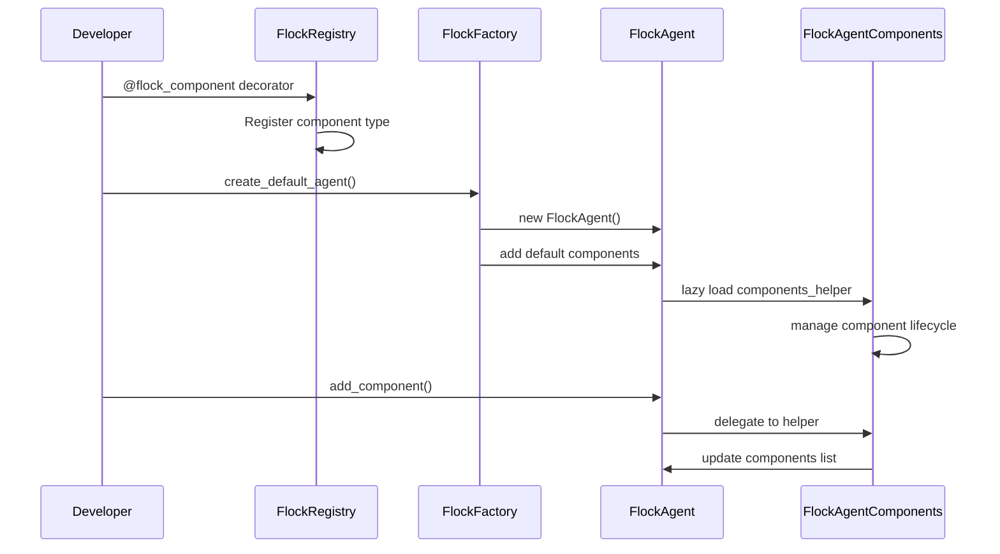
```mermaid
sequenceDiagram
    participant Dev as Developer
    participant Registry as FlockRegistry
    participant Factory as FlockFactory
    participant Agent as FlockAgent
    participant Helper as FlockAgentComponents
    
    Dev->>Registry: @flock_component decorator
    Registry->>Registry: Register component type
    
    Dev->>Factory: create_default_agent()
    Factory->>Agent: new FlockAgent()
    Factory->>Agent: add default components
    
    Agent->>Helper: lazy load components_helper
    Helper->>Helper: manage component lifecycle
    
    Dev->>Agent: add_component()
    Agent->>Helper: delegate to helper
    Helper->>Agent: update components list
```

## 3. Execution Flow Architecture

### 3.1 Agent Execution Pipeline

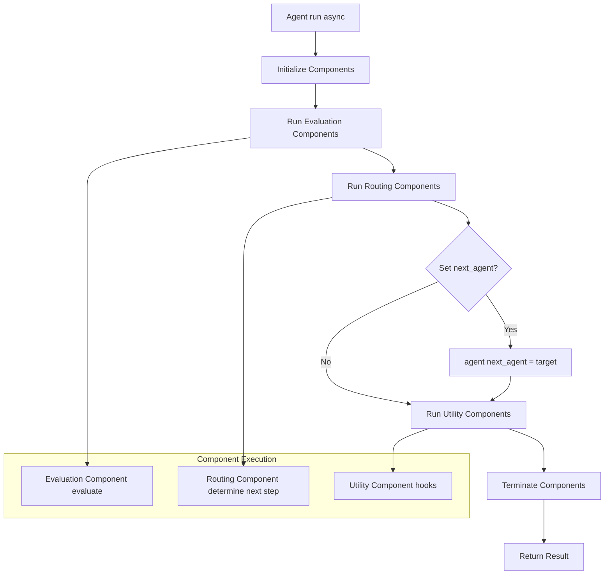
```mermaid
flowchart TD
    Start[Agent run async] --> Init[Initialize Components]
    Init --> Eval[Run Evaluation Components]
    Eval --> Route[Run Routing Components]
    Route --> SetNext{Set next_agent?}
    SetNext -->|Yes| NextAgent[agent next_agent = target]
    SetNext -->|No| Util[Run Utility Components]
    NextAgent --> Util
    Util --> Term[Terminate Components]
    Term --> End[Return Result]
    
    subgraph Component Execution
        EvalComp[Evaluation Component evaluate]
        RouteComp[Routing Component determine next step]
        UtilComp[Utility Component hooks]
    end
    
    Eval --> EvalComp
    Route --> RouteComp
    Util --> UtilComp
```

### 3.2 Workflow Orchestration

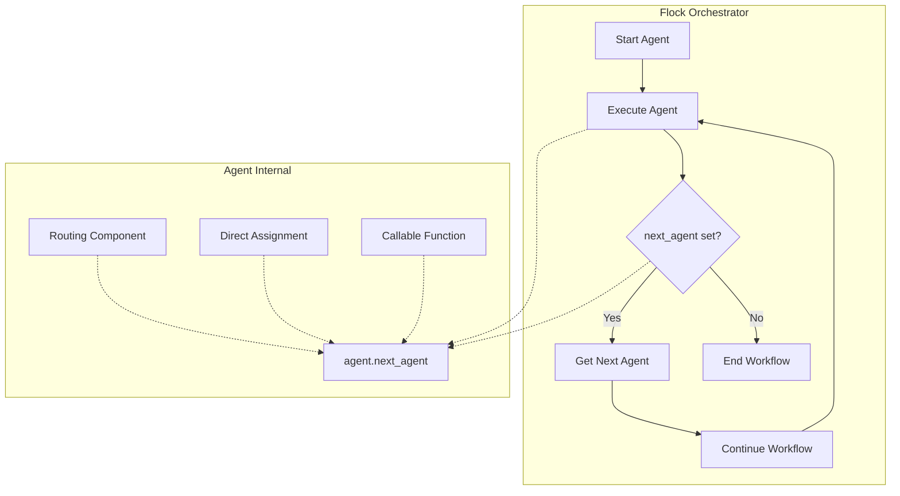
```mermaid
graph TB
    subgraph "Flock Orchestrator"
        Start[Start Agent]
        Execute[Execute Agent]
        CheckNext{next_agent set?}
        GetNext[Get Next Agent]
        Continue[Continue Workflow]
        End[End Workflow]
    end
    
    Start --> Execute
    Execute --> CheckNext
    CheckNext -->|Yes| GetNext
    CheckNext -->|No| End
    GetNext --> Continue
    Continue --> Execute
    
    subgraph "Agent Internal"
        NextProp[agent.next_agent]
        Router[Routing Component]
        Direct[Direct Assignment]
        Callable[Callable Function]
    end
    
    Router -.-> NextProp
    Direct -.-> NextProp
    Callable -.-> NextProp
    Execute -.-> NextProp
    CheckNext -.-> NextProp
```

## 4. Configuration Architecture

### 4.1 Configuration Separation

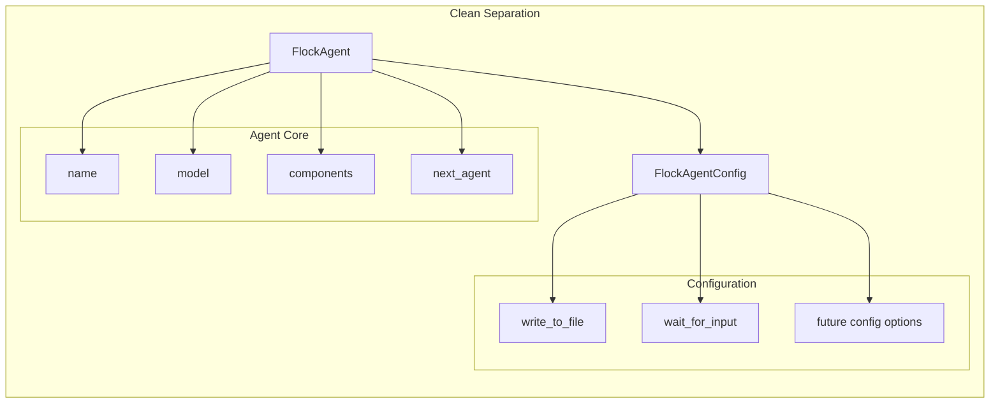
```mermaid
graph LR
    subgraph "Clean Separation"
        Agent[FlockAgent]
        Config[FlockAgentConfig]
        
        subgraph "Agent Core"
            Name[name]
            Model[model]
            Components[components]
            NextAgent[next_agent]
        end
        
        subgraph "Configuration"
            WriteFile[write_to_file]
            WaitInput[wait_for_input]
            Future[future config options]
        end
    end
    
    Agent --> Name
    Agent --> Model
    Agent --> Components
    Agent --> NextAgent
    Agent --> Config
    Config --> WriteFile
    Config --> WaitInput
    Config --> Future
```

## 5. Current Architecture Ratings

### 5.1 Component Ratings

| Component | Rating | Strengths | Issues |
|-----------|--------|-----------|--------|
| **FlockAgent** | 9/10 â­â­â­â­â­â­â­â­â­â˜† | Clean interface, focused responsibility | Some formatting issues |
| **Unified Components** | 9/10 â­â­â­â­â­â­â­â­â­â˜† | Consistent naming, clear hierarchy | Need more component types |
| **Component Helper** | 8/10 â­â­â­â­â­â­â­â­â˜†â˜† | Rich functionality, no duplication | Could be more discoverable |
| **FlockRegistry** | 7/10 â­â­â­â­â­â­â­â˜†â˜†â˜† | Auto-registration works | Global state issues |
| **FlockFactory** | 8/10 â­â­â­â­â­â­â­â­â˜†â˜† | Easy agent creation | Could be more flexible |
| **Configuration** | 9/10 â­â­â­â­â­â­â­â­â­â˜† | Clean separation achieved | Needs more config options |

### 5.2 Quality Metrics

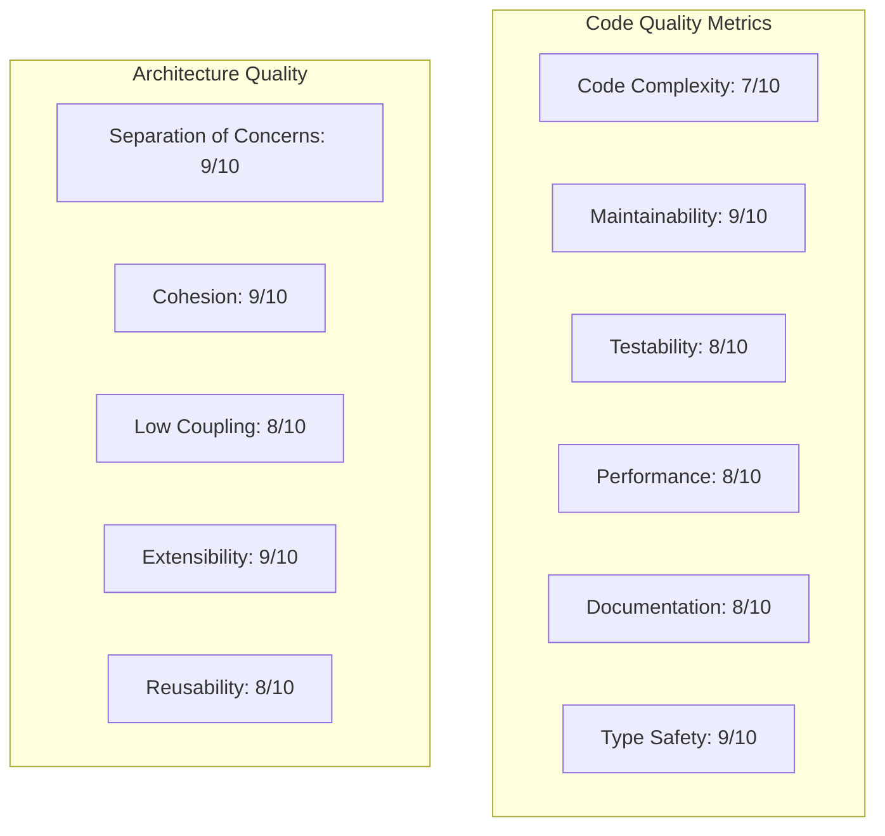
```mermaid
graph TB
    subgraph "Code Quality Metrics"
        Complexity[Code Complexity: 7/10]
        Maintainability[Maintainability: 9/10]
        Testability[Testability: 8/10]
        Performance[Performance: 8/10]
        Documentation[Documentation: 8/10]
        TypeSafety[Type Safety: 9/10]
    end
    
    subgraph "Architecture Quality"
        Separation[Separation of Concerns: 9/10]
        Cohesion[Cohesion: 9/10]
        Coupling[Low Coupling: 8/10]
        Extensibility[Extensibility: 9/10]
        Reusability[Reusability: 8/10]
    end
```

## 6. Identified Issues & Optimization Opportunities

### 6.1 Current Issues

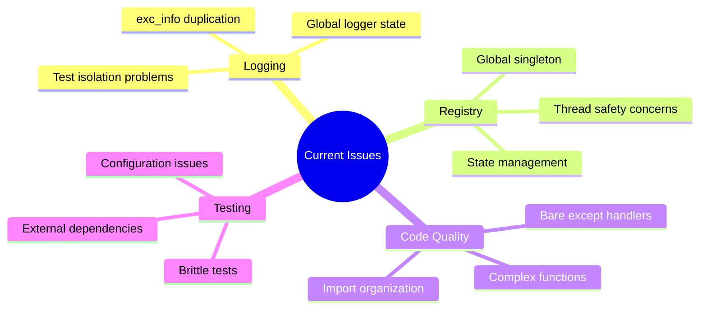
```mermaid
mindmap
  root((Current Issues))
    Logging
      exc_info duplication
      Global logger state
      Test isolation problems
    Registry
      Global singleton
      Thread safety concerns
      State management
    Code Quality
      Bare except handlers
      Complex functions
      Import organization
    Testing
      External dependencies
      Brittle tests
      Configuration issues
```

### 6.2 Priority Optimization Areas

| Priority | Area | Issue | Impact | Effort |
|----------|------|-------|--------|--------|
| **High** | Logging System | `exc_info` conflicts | Test failures | Medium |
| **High** | Registry Thread Safety | Global state races | Production bugs | High |
| **Medium** | Error Handling | Bare `except:` blocks | Hidden bugs | Low |
| **Medium** | Function Complexity | Complex `to_dict()` methods | Maintenance | Medium |
| **Low** | Import Organization | Unsorted imports | Code quality | Low |

## 7. Proposed Architectural Improvements

### 7.1 Enhanced Component Discovery

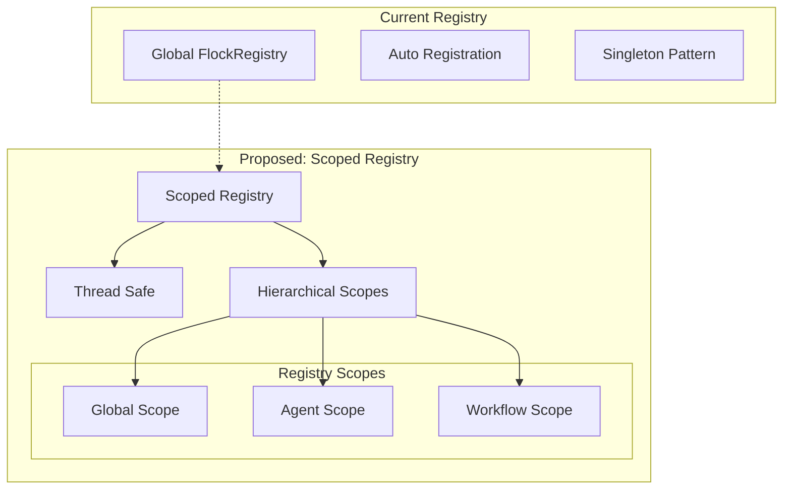
```mermaid
graph TD
    subgraph "Current Registry"
        GlobalReg[Global FlockRegistry]
        AutoReg[Auto Registration]
        Singleton[Singleton Pattern]
    end
    
    subgraph "Proposed: Scoped Registry"
        ScopedReg[Scoped Registry]
        ThreadSafe[Thread Safe]
        Hierarchical[Hierarchical Scopes]
        
        subgraph "Registry Scopes"
            GlobalScope[Global Scope]
            AgentScope[Agent Scope]
            WorkflowScope[Workflow Scope]
        end
    end
    
    GlobalReg -.-> ScopedReg
    ScopedReg --> ThreadSafe
    ScopedReg --> Hierarchical
    Hierarchical --> GlobalScope
    Hierarchical --> AgentScope
    Hierarchical --> WorkflowScope
```

### 7.2 Advanced Component Patterns

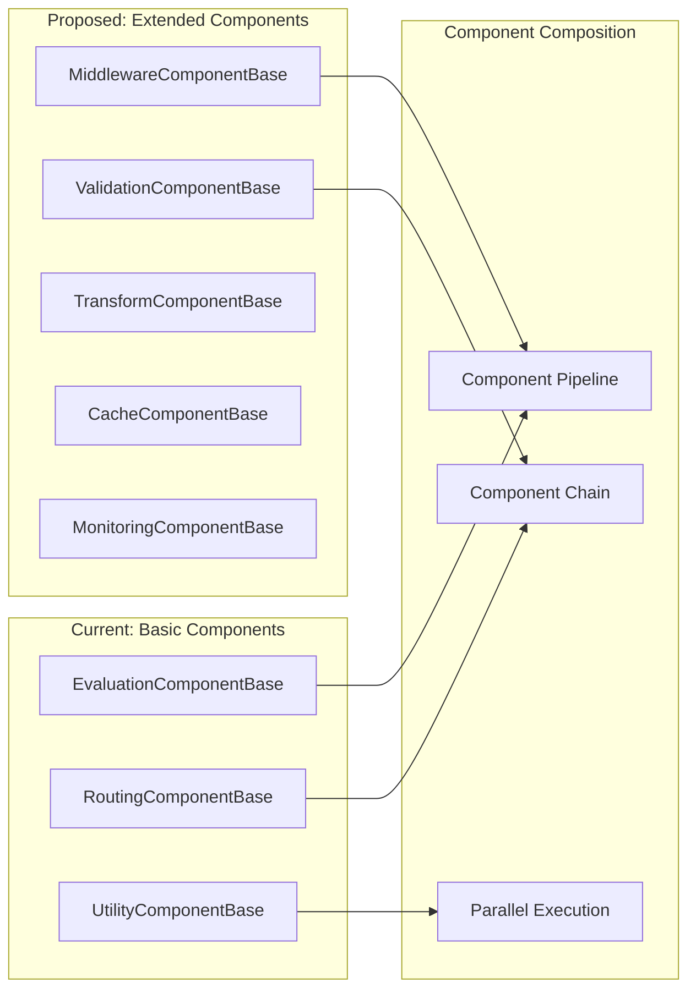
```mermaid
graph LR
    subgraph "Current: Basic Components"
        Eval[EvaluationComponentBase]
        Route[RoutingComponentBase] 
        Util[UtilityComponentBase]
    end
    
    subgraph "Proposed: Extended Components"
        Middleware[MiddlewareComponentBase]
        Validator[ValidationComponentBase]
        Transform[TransformComponentBase]
        Cache[CacheComponentBase]
        Monitor[MonitoringComponentBase]
    end
    
    subgraph "Component Composition"
        Pipeline[Component Pipeline]
        Chain[Component Chain]
        Parallel[Parallel Execution]
    end
    
    Eval --> Pipeline
    Route --> Chain
    Util --> Parallel
    Middleware --> Pipeline
    Validator --> Chain
```

### 7.3 Enhanced Configuration System

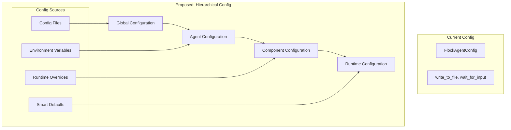
```mermaid
graph TB
    subgraph "Current Config"
        AgentConfig[FlockAgentConfig]
        Basic[write_to_file, wait_for_input]
    end
    
    subgraph "Proposed: Hierarchical Config"
        GlobalConfig[Global Configuration]
        AgentConfig2[Agent Configuration]
        ComponentConfig[Component Configuration]
        RuntimeConfig[Runtime Configuration]
        
        subgraph "Config Sources"
            Files[Config Files]
            Env[Environment Variables]
            Runtime[Runtime Overrides]
            Defaults[Smart Defaults]
        end
    end
    
    GlobalConfig --> AgentConfig2
    AgentConfig2 --> ComponentConfig
    ComponentConfig --> RuntimeConfig
    
    Files --> GlobalConfig
    Env --> AgentConfig2
    Runtime --> ComponentConfig
    Defaults --> RuntimeConfig
```

## 8. Performance Optimization Opportunities

### 8.1 Component Caching Strategy

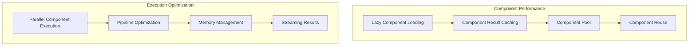
```mermaid
graph TD
    subgraph "Component Performance"
        Lazy[Lazy Component Loading]
        Cache[Component Result Caching]
        Pool[Component Pool]
        Reuse[Component Reuse]
    end
    
    subgraph "Execution Optimization"
        Parallel[Parallel Component Execution]
        Pipeline[Pipeline Optimization]
        Memory[Memory Management]
        Streaming[Streaming Results]
    end
    
    Lazy --> Cache
    Cache --> Pool
    Pool --> Reuse
    
    Parallel --> Pipeline
    Pipeline --> Memory
    Memory --> Streaming
```

### 8.2 Memory Management

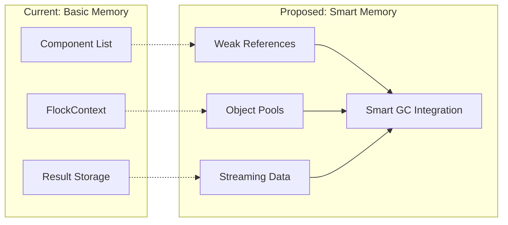
```mermaid
graph LR
    subgraph "Current: Basic Memory"
        Components[Component List]
        Context[FlockContext]
        Results[Result Storage]
    end
    
    subgraph "Proposed: Smart Memory"
        WeakRefs[Weak References]
        ObjPools[Object Pools]
        GC[Smart GC Integration]
        Streaming[Streaming Data]
    end
    
    Components -.-> WeakRefs
    Context -.-> ObjPools
    Results -.-> Streaming
    
    WeakRefs --> GC
    ObjPools --> GC
    Streaming --> GC
```

## 9. Testing Architecture Improvements

### 9.1 Test Isolation Strategy

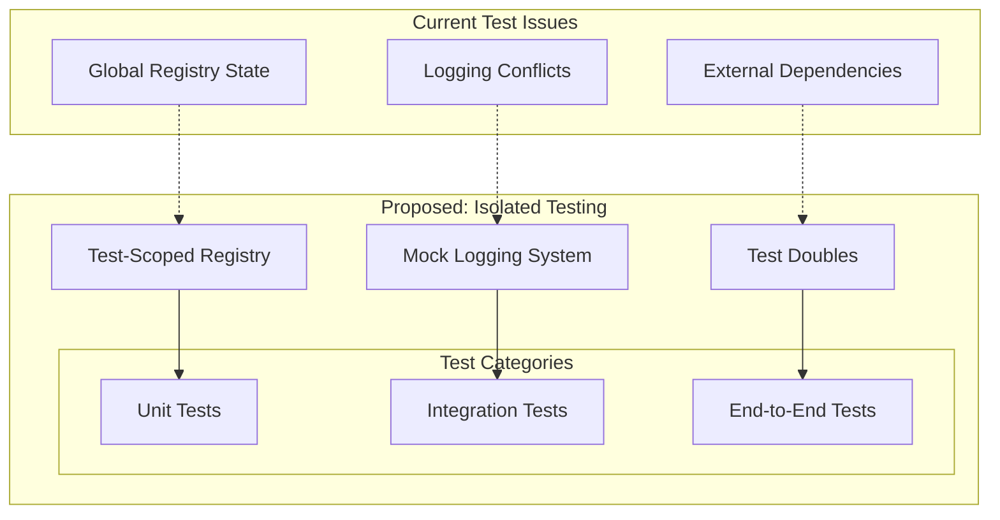
```mermaid
graph TD
    subgraph "Current Test Issues"
        GlobalState[Global Registry State]
        LogConflicts[Logging Conflicts]
        External[External Dependencies]
    end
    
    subgraph "Proposed: Isolated Testing"
        TestRegistry[Test-Scoped Registry]
        MockLogging[Mock Logging System]
        TestDoubles[Test Doubles]
        
        subgraph "Test Categories"
            Unit[Unit Tests]
            Integration[Integration Tests]
            E2E[End-to-End Tests]
        end
    end
    
    GlobalState -.-> TestRegistry
    LogConflicts -.-> MockLogging
    External -.-> TestDoubles
    
    TestRegistry --> Unit
    MockLogging --> Integration
    TestDoubles --> E2E
```

## 10. Security Architecture Considerations

### 10.1 Security Layers

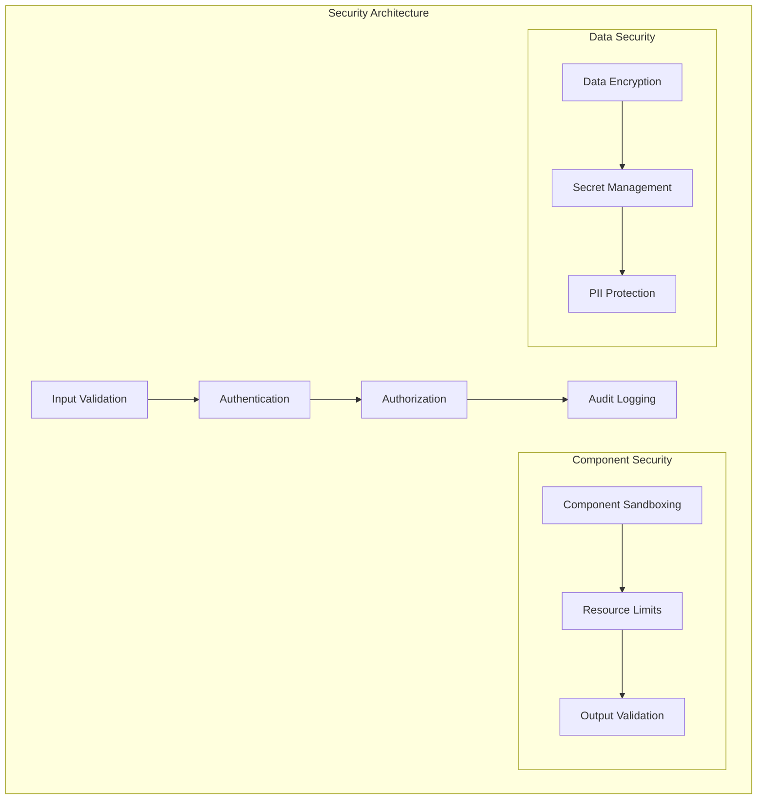
```mermaid
graph TB
    subgraph "Security Architecture"
        Input[Input Validation]
        Auth[Authentication]
        Authz[Authorization]
        Audit[Audit Logging]
        
        subgraph "Component Security"
            Sandbox[Component Sandboxing]
            Limits[Resource Limits]
            Validation[Output Validation]
        end
        
        subgraph "Data Security"
            Encryption[Data Encryption]
            Secrets[Secret Management]
            PII[PII Protection]
        end
    end
    
    Input --> Auth
    Auth --> Authz
    Authz --> Audit
    
    Sandbox --> Limits
    Limits --> Validation
    
    Encryption --> Secrets
    Secrets --> PII
```

## 11. Recommended Next Steps

### 11.1 Short Term (1-2 Weeks)

1. **Fix Logging System** - Resolve `exc_info` conflicts
2. **Registry Thread Safety** - Add proper synchronization
3. **Error Handling Cleanup** - Replace bare `except:` blocks
4. **Import Organization** - Fix import sorting issues

### 11.2 Medium Term (1-2 Months)

1. **Enhanced Component Types** - Add middleware, validation components
2. **Configuration Hierarchy** - Implement multi-level config system
3. **Performance Optimization** - Add component caching and pooling
4. **Test Isolation** - Implement scoped test registry

### 11.3 Long Term (3-6 Months)

1. **Advanced Patterns** - Component pipelines and composition
2. **Security Framework** - Complete security architecture
3. **Monitoring & Observability** - Enhanced telemetry system
4. **Performance Analytics** - Component performance profiling

## 12. Architecture Evolution Roadmap

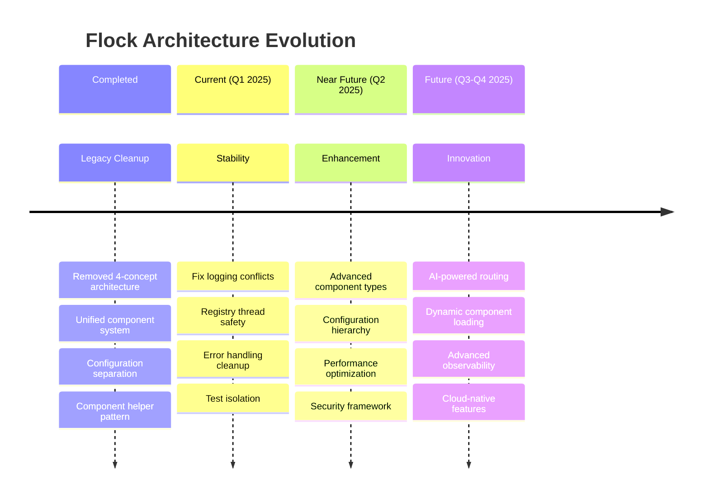
```mermaid
timeline
    title Flock Architecture Evolution
    
    section Completed
        Legacy Cleanup    : Removed 4-concept architecture
                         : Unified component system
                         : Configuration separation
                         : Component helper pattern
    
    section Current (Q1 2025)
        Stability        : Fix logging conflicts
                        : Registry thread safety
                        : Error handling cleanup
                        : Test isolation
    
    section Near Future (Q2 2025)
        Enhancement      : Advanced component types
                        : Configuration hierarchy
                        : Performance optimization
                        : Security framework
    
    section Future (Q3-Q4 2025)
        Innovation       : AI-powered routing
                        : Dynamic component loading
                        : Advanced observability
                        : Cloud-native features
```

## 13. Competitive Analysis: Flock vs. Other Agent Frameworks

### 13.1 Framework Comparison Matrix

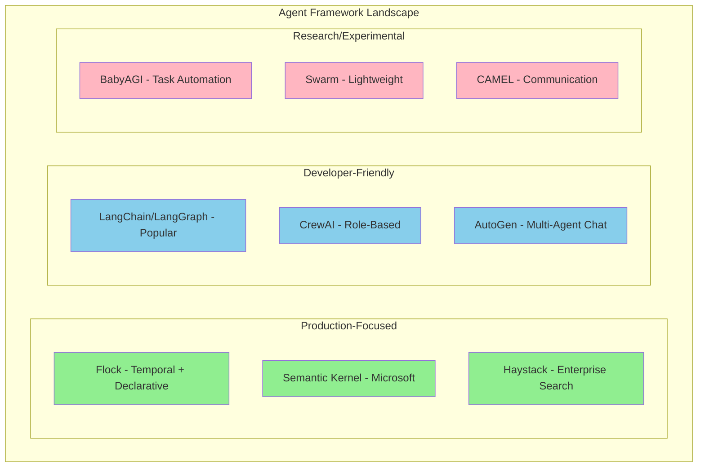
```mermaid
graph TD
    subgraph "Agent Framework Landscape"
        subgraph "Production-Focused"
            Flock[Flock - Temporal + Declarative]
            Semantic[Semantic Kernel - Microsoft]
            Haystack[Haystack - Enterprise Search]
        end
        
        subgraph "Developer-Friendly"
            LangChain[LangChain/LangGraph - Popular]
            CrewAI[CrewAI - Role-Based]
            AutoGen[AutoGen - Multi-Agent Chat]
        end
        
        subgraph "Research/Experimental"
            BabyAGI[BabyAGI - Task Automation]
            Swarm[Swarm - Lightweight]
            Camel[CAMEL - Communication]
        end
    end
    
    classDef production fill:#90EE90
    classDef developer fill:#87CEEB  
    classDef research fill:#FFB6C1
    
    class Flock,Semantic,Haystack production
    class LangChain,CrewAI,AutoGen developer
    class BabyAGI,Swarm,Camel research
```

### 13.2 Feature Comparison

| Feature | Flock | LangChain | AutoGen | CrewAI | Semantic Kernel |
|---------|-------|-----------|---------|--------|-----------------|
| **Production Ready** | ✅ | âš ï¸ | âš ï¸ | âš ï¸ | ✅ |
| **Temporal Resilience** | ✅ | ⌠| ⌠| ⌠| ⌠|
| **Declarative Contracts** | ✅ | ⌠| ⌠| ⌠| âš ï¸ |
| **Type Safety** | ✅ | âš ï¸ | âš ï¸ | âš ï¸ | ✅ |
| **Testing Framework** | ✅ | âš ï¸ | âš ï¸ | âš ï¸ | âš ï¸ |
| **Component Architecture** | ✅ | âš ï¸ | ⌠| âš ï¸ | ✅ |
| **Multi-Agent Workflows** | ✅ | ✅ | ✅ | ✅ | ✅ |
| **REST API Deploy** | ✅ | âš ï¸ | ⌠| âš ï¸ | ✅ |
| **Community Size** | 🔴 | 🟢 | 🟡 | 🟡 | 🟡 |
| **Documentation** | 🟡 | 🟢 | 🟡 | 🟡 | 🟢 |
| **Learning Curve** | 🟡 | 🔴 | 🟡 | 🟢 | 🟡 |

**Legend**: ✅ Excellent | âš ï¸ Partial | ⌠Missing | 🟢 High | 🟡 Medium | 🔴 Low

### 13.3 Unique Value Propositions

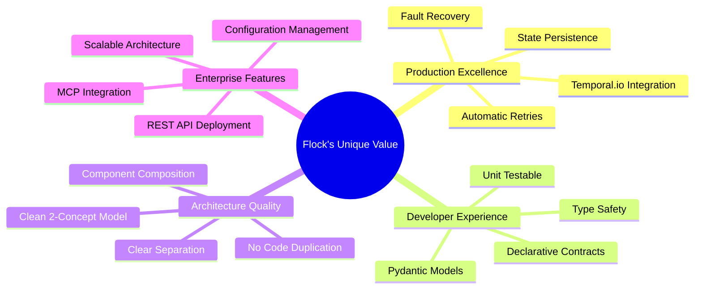
```mermaid
mindmap
  root((Flock's Unique Value))
    Production Excellence
      Temporal.io Integration
      Automatic Retries
      State Persistence
      Fault Recovery
    Developer Experience
      Declarative Contracts
      Pydantic Models
      Type Safety
      Unit Testable
    Architecture Quality
      Clean 2-Concept Model
      Component Composition
      No Code Duplication
      Clear Separation
    Enterprise Features
      REST API Deployment
      Scalable Architecture
      Configuration Management
      MCP Integration
```

### 13.4 Framework Positioning

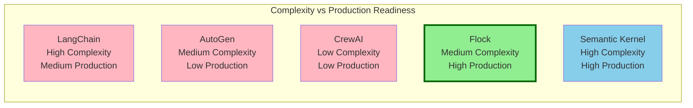
```mermaid
graph LR
    subgraph "Complexity vs Production Readiness"
        LangChain[LangChain<br/>High Complexity<br/>Medium Production]
        AutoGen[AutoGen<br/>Medium Complexity<br/>Low Production]
        CrewAI[CrewAI<br/>Low Complexity<br/>Low Production]
        Flock[Flock<br/>Medium Complexity<br/>High Production]
        Semantic[Semantic Kernel<br/>High Complexity<br/>High Production]
    end
    
    classDef optimal fill:#90EE90,stroke:#006400,stroke-width:3px
    classDef good fill:#87CEEB
    classDef basic fill:#FFB6C1
    
    class Flock optimal
    class Semantic good
    class LangChain,AutoGen,CrewAI basic
```

## 14. Would I Use Flock? My Honest Assessment

### 14.1 The Good: Why I'd Choose Flock ✅

**For Production Systems**: Absolutely yes! Here's why:

1. **Temporal.io Integration is Game-Changing** ğŸ¯
   - Built-in resilience without additional complexity
   - Automatic retries and state recovery
   - Production debugging capabilities
   - This alone is worth switching frameworks

2. **Declarative Contracts Solve Real Problems** 📋
   - Input/output validation prevents runtime errors
   - Self-documenting agent interfaces
   - Makes integration testing actually possible
   - Reduces debugging time significantly

3. **Clean Architecture** ğŸ—ï¸
   - 2-concept model is genuinely easier to understand
   - Component composition feels natural
   - No fighting the framework to do what you want

4. **Production Features Out-of-Box** 🚀
   - REST API deployment without custom work
   - Configuration management
   - Proper error handling patterns

### 14.2 The Challenges: Where I'd Hesitate âš ï¸

```mermaid
graph TB
    subgraph "Adoption Barriers"
        Community[Small Community]
        Docs[Limited Documentation]
        Examples[Fewer Examples]
        Ecosystem[Smaller Ecosystem]
    end
    
    subgraph "Learning Curve"
        Temporal[Temporal.io Complexity]
        Concepts[New Concepts to Learn]
        Migration[Migration from Existing]
    end
    
    Community --> Ecosystem
    Docs --> Examples
    Temporal --> Concepts
    Concepts --> Migration
```

**Honest Concerns:**

1. **Community Size**: LangChain's massive community means faster problem-solving
2. **Documentation Gaps**: Need more real-world examples and tutorials
3. **Temporal Learning Curve**: Teams need to learn Temporal concepts
4. **Ecosystem**: Fewer pre-built integrations than established frameworks

### 14.3 Use Case Suitability

| Use Case | Flock Rating | Alternative |
|----------|--------------|-------------|
| **Enterprise Production** | 🟢 9/10 | Semantic Kernel |
| **Rapid Prototyping** | 🟡 6/10 | LangChain/CrewAI |
| **Research/Experimentation** | 🟡 7/10 | AutoGen |
| **Mission-Critical Systems** | 🟢 10/10 | None better |
| **Team Collaboration** | 🟡 7/10 | CrewAI |
| **Complex Workflows** | 🟢 9/10 | LangGraph |

## 15. Flock World Domination Plan ğŸŒ

### 15.1 What Flock Needs to Win

```mermaid
timeline
    title Path to Framework Dominance
    
    section Foundation (Next 3 Months)
        Developer Experience : Rich documentation
                            : Video tutorials
                            : Interactive examples
                            : Better error messages
        
        Community Building   : Discord/Slack community
                            : Regular office hours
                            : Contribution guidelines
                            : Showcase gallery
    
    section Growth (3-6 Months)
        Ecosystem           : Pre-built integrations
                           : Component marketplace
                           : Templates library
                           : VS Code extension
        
        Performance         : Benchmarking suite
                           : Performance comparisons
                           : Optimization guides
                           : Resource monitoring
    
    section Dominance (6-12 Months)
        Enterprise Features : Enterprise support
                           : Security certifications
                           : Compliance tools
                           : Migration utilities
        
        Innovation         : AI-powered development
                          : Auto-optimization
                          : Predictive scaling
                          : Advanced observability
```

### 15.2 Critical Success Factors

#### **1. Developer Experience Revolution** 🚀

```mermaid
graph LR
    subgraph "DX Improvements"
        CLI[Powerful CLI Tools]
        IDE[IDE Integration]
        Debug[Visual Debugging]
        Hot[Hot Reloading]
    end
    
    subgraph "Learning Resources"
        Tutorials[Interactive Tutorials]
        Recipes[Code Recipes]
        Patterns[Best Practices]
        Migration[Migration Guides]
    end
    
    CLI --> Debug
    IDE --> Hot
    Tutorials --> Recipes
    Patterns --> Migration
```

**Must-Have Features:**
- **Flock CLI**: `flock create`, `flock deploy`, `flock debug`
- **VS Code Extension**: Syntax highlighting, debugging, component explorer
- **Interactive Documentation**: Runnable examples in browser
- **Agent Builder UI**: Visual agent composition tool

#### **2. Ecosystem Explosion** 🌟

**Pre-built Component Library:**
- Database connectors (PostgreSQL, MongoDB, Redis)
- API integrations (Slack, GitHub, Jira, Salesforce)
- AI service connectors (OpenAI, Anthropic, Google, AWS)
- Data processing components (PDF, CSV, JSON, XML)
- Monitoring components (Datadog, New Relic, Prometheus)

**Template Gallery:**
- Customer service bot
- Data analysis pipeline
- Content generation workflow
- Code review automation
- Sales process automation

#### **3. Performance & Benchmarking** âš¡

```mermaid
graph TB
    subgraph "Performance Excellence"
        Benchmarks[Public Benchmarks vs Competitors]
        Optimization[Auto-Optimization Features]
        Monitoring[Real-time Performance Monitoring]
        Scaling[Predictive Auto-Scaling]
    end
    
    subgraph "Reliability"
        SLA[99.9% SLA Guarantees]
        Recovery[Sub-second Recovery]
        Testing[Chaos Engineering]
        Monitoring2[24/7 Health Monitoring]
    end
    
    Benchmarks --> Optimization
    Optimization --> Monitoring
    Monitoring --> Scaling
```

#### **4. Enterprise Adoption Strategy** ğŸ¢

**Enterprise Readiness Checklist:**
- [ ] SOC 2 Type II Compliance
- [ ] GDPR/CCPA Data Protection
- [ ] Enterprise SSO Integration
- [ ] Audit Logging & Compliance
- [ ] 24/7 Enterprise Support
- [ ] Professional Services Team
- [ ] Migration Tools from LangChain
- [ ] White-label Deployment Options

### 15.3 Marketing & Positioning Strategy

#### **The "Temporal Advantage" Campaign** 📢

```mermaid
graph LR
    subgraph "Messaging Pillars"
        Resilient[The Only Resilient<br/>Agent Framework]
        Production[Production-First<br/>Architecture]
        Testing[Actually Testable<br/>AI Agents]
        Enterprise[Enterprise-Ready<br/>Out of Box]
    end
    
    subgraph "Target Audiences"
        CTOs[CTOs/VPs Engineering]
        DevLeads[Development Leads]
        MLEs[ML Engineers]
        DevOps[DevOps Teams]
    end
    
    Resilient --> CTOs
    Production --> DevLeads
    Testing --> MLEs
    Enterprise --> DevOps
```

**Key Messages:**
1. **"Stop Fighting Agent Failures"** - Temporal resilience story
2. **"Deploy Agents Like Microservices"** - Production readiness angle
3. **"Test Your Agents Like Code"** - Quality assurance narrative
4. **"Scale Without Surprises"** - Enterprise reliability promise

### 15.4 Competitive Differentiation

#### **How to Beat Each Competitor:**

| vs LangChain | vs AutoGen | vs CrewAI | vs Semantic Kernel |
|--------------|------------|-----------|-------------------|
| **Reliability** | **Simplicity** | **Production** | **Innovation** |
| Temporal resilience | Cleaner architecture | Enterprise features | Faster iteration |
| Better testing | Type safety | Better performance | Community focus |
| Production ready | Less complexity | Real deployments | Open ecosystem |

### 15.5 Success Metrics

**Adoption Goals (12 months):**
- 🯠**10,000+ GitHub Stars** (currently ~few hundred)
- 🯠**1,000+ Production Deployments**
- 🯠**100+ Enterprise Customers**
- 🯠**50+ Community Contributors**
- 🯠**95%+ Developer Satisfaction Score**

## 16. My Final Verdict: Would I Use Flock?

### **YES, with conditions** ✅

**For Production Systems**: Absolutely. The Temporal integration alone makes it worth the switch.

**For Side Projects**: Maybe. Depends if I need the production features or just want to prototype quickly.

**For Enterprise**: Definitely. No other framework comes close to Flock's production readiness.

### **The Honest Truth** 💭

Flock is like **Tesla in 2012** - clearly superior technology, but needs time to build the ecosystem and community that makes it the obvious choice. The technical foundation is solid, the architecture is clean, and the unique value propositions (Temporal, declarative contracts, production-ready) are genuinely compelling.

**If the team executes on the world domination plan above, Flock could become the dominant enterprise agent framework within 18-24 months.**

The question isn't whether Flock is good enough - it's whether the team can build the community and ecosystem fast enough to compete with LangChain's head start.

**My bet: In 2-3 years, production teams will use Flock, hobbyists will use LangChain, and researchers will use whatever's newest.** 🚀

## 17. Conclusion

The Flock framework has achieved a **solid architectural foundation** with the unified component system. The migration from 4 concepts to 2 concepts has significantly improved code clarity and maintainability.

### Strengths ✅
- Clean separation of concerns
- Unified component architecture
- No code duplication
- Strong type safety
- Comprehensive functionality
- **Temporal.io integration (unique competitive advantage)**
- **Production-ready architecture (rare in agent frameworks)**

### Priority Improvements 🔧
- Logging system stability
- Registry thread safety
- Error handling robustness
- Test isolation
- Performance optimization
- **Community building and ecosystem development**
- **Developer experience improvements**

### Overall Assessment: **8.5/10** 
The architecture is production-ready with clear optimization paths forward. **Flock has the potential to become the dominant enterprise agent framework** with proper execution of community building and ecosystem development.
